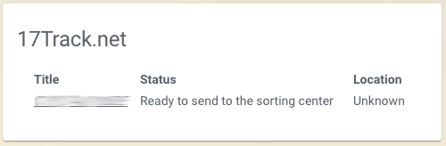

# 17Track.net Card

This card give you a list of shipment information generated by the official [17track.net sensor](https://www.home-assistant.io/components/seventeentrack/).

## Options

| Name | Type | Requirement | Description
| ---- | ---- | ------- | -----------
| type | string | **Required** | `custom:seventeen-track-card`
| entity | string | **Required** | The entity_id of the entity you want to show (for example, `sensor.seventeentrack_packages_in_transit`).
| title | string | **Optional** | Add a custom title to the card.

## Manual installation

### Step 1

Install `seventeen-track-card` by copying `seventeen-track-card.js` from this repo to `<config directory>/www/seventeen-track-card.js` on your Home Assistant instanse.

**Example:**

```bash
wget https://raw.githubusercontent.com/ping-localhost/seventeen-track-card/master/seventeen-track-card.js
mv seventeen-track-card.js /config/www/
```

### Step 2

Link `seventeen-track-card` inside you `ui-lovelace.yaml`.

```yaml
resources:
  - url: /local/seventeen-track-card.js?v=1.0
    type: js
```

## HACS installation

### Step 1

Install HACS as specified here: [Installation guide](https://hacs.netlify.com/installation/manual/).

### Step 2

Add my repository as a custom repostiory in the HACS settings (and be sure to select the `Plugin`-category). 

### Step 3

Install the card as you are used to and set it up as instructed by HACS, which consists of adding:
``` yml
  - url: /community_plugin/seventeen-track-card/seventeen-track-card.js
    type: js
```

### Step 4

Add a custom element in your `ui-lovelace.yaml`

```yaml
      - type: custom:seventeen-track-card
        entity: sensor.seventeentrack_packages_in_transit
```

# Final result



**Suggestion**: If you set a "memo" in 17Track, it will be displayed in the frontend as well.
